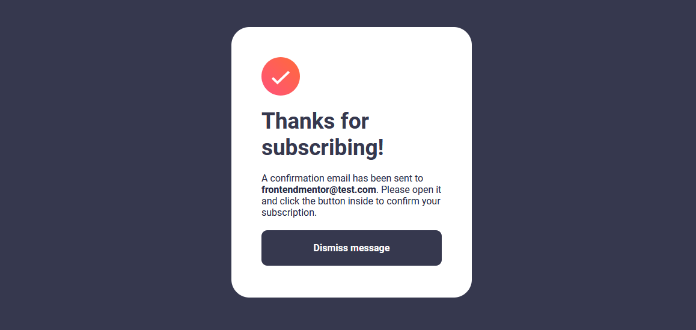
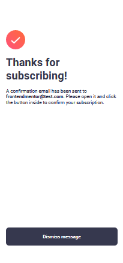

# Frontend Mentor - Newsletter sign-up form with success message solution

This is a solution to the [Newsletter sign-up form with success message challenge on Frontend Mentor](https://www.frontendmentor.io/challenges/newsletter-signup-form-with-success-message-3FC1AZbNrv). Frontend Mentor challenges help you improve your coding skills by building realistic projects.

## Table of contents

- [Overview](#overview)
  - [The challenge](#the-challenge)
  - [Screenshot](#screenshot)
  - [Links](#links)
- [My process](#my-process)
  - [Built with](#built-with)
  - [What I learned](#what-i-learned)
- [Author](#author)

## Overview

### The challenge

Users should be able to:

- Add their email and submit the form
- See a success message with their email after successfully submitting the form
- See form validation messages if:
  - The field is left empty
  - The email address is not formatted correctly
- View the optimal layout for the interface depending on their device's screen size
- See hover and focus states for all interactive elements on the page

## Screenshot

### Form Desktop


### Form Mobile


### Success message for Desktop



### Success message for mobile



### Links

- Solution URL: [Add solution URL here](https://your-solution-url.com)
- Live Site URL: [Demo](https://juanblancodev.github.io/newsletter-sign-up-form)

## My process

### Built with

- Semantic HTML5 markup
- CSS custom properties
- Flexbox
- CSS Grid
- Mobile-first workflow
- [React](https://reactjs.org/) - JS library
- [React Hook Form](https://react-hook-form.com/) - Para validar el formulario
- [Styled Components](https://styled-components.com/) - For styles

### What I learned

I reinforced knowledge about how to manage forms with react-hook-form

```jsx
const {
  register,
  handleSubmit,
  formState: { errors },
} = useForm();
const emailRules = {
  required: "Email is required",
  pattern: {
    value: /^[A-Z0-9._%+-]+@[A-Z0-9.-]+\.[A-Z]{2,}$/i,
    message: "Email is invalid",
  },
};
```

```jsx
<FormContainer onSubmit={handleSubmit(onSubmit)}>
  <Field>
    <Messages>
      <p className="fw-bold color-charcoal-grey">Email address</p>
      {errors.email && <Span>{errors.email.message}</Span>}
    </Messages>
    <Input
      type="email"
      placeholder="email@company.com"
      {...register("email", emailRules)}
    />
  </Field>
  <button className="btn fw-bold color-white fs-normal">
    Subscribe to monthly newsletter
  </button>
</FormContainer>
```

## Author

- GitHub - [JuanBlancodev](https://github.com/JuanBlancodev)
- Frontend Mentor - [@JuanBlancodev](https://www.frontendmentor.io/profile/JuanBlancodev)